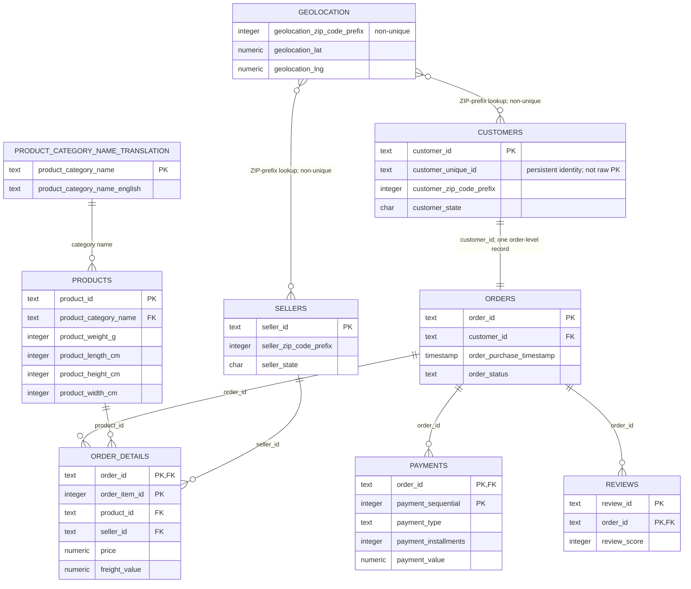
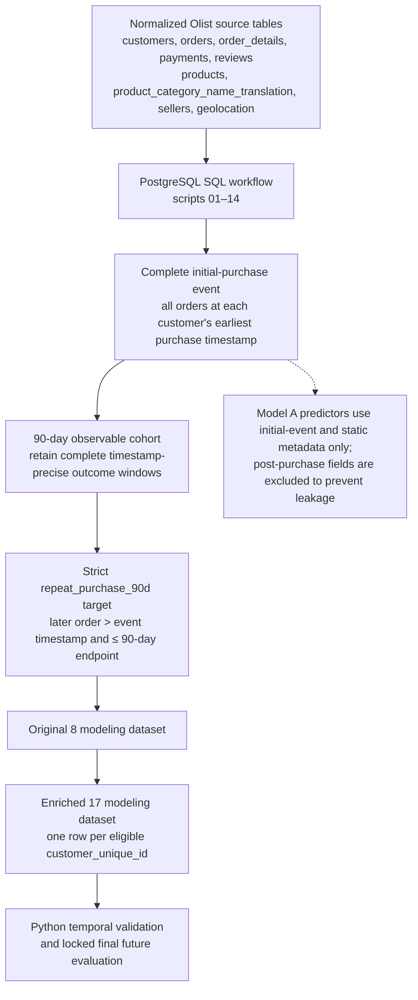

# Olist 90-Day Repeat-Purchase Prediction

> **Portfolio status:** Model A is complete. The project builds a leakage-aware initial-purchase dataset, compares Original 8 and Enriched 17 feature sets with temporal validation, and evaluates one locked model on a final future holdout.

## Executive Summary

Can information available when a customer makes their **initial-purchase event** help predict whether they will place another order within 90 days?

Using the Olist Brazilian e-commerce dataset, this project constructs a one-row-per-customer analytical dataset in PostgreSQL and evaluates Model A in Python. The enriched feature set improved Logistic Regression consistently during temporal validation, but its ranking signal weakened in the final future holdout. The result is a careful, honest portfolio finding: initial-purchase information contains weak but detectable ranking signal, not a production-ready repeat-purchase classifier.

## Final Result

| Item | Result |
|---|---:|
| Eligible customers | 86,924 |
| 90-day repeat purchasers | 1,707 (1.9638%) |
| Selected model | Enriched 17 + Logistic Regression |
| Temporal-validation mean AP | 0.0290 |
| Temporal-validation mean ROC-AUC | 0.5785 |
| Final future-holdout customers | 17,287 |
| Final future-holdout repeat prevalence | 1.3131% |
| Final ROC-AUC | 0.5440 |
| Final Average Precision | 0.0186 |
| Final top-1% lift | 3.0814 |
| Final top-5% lift | 1.6728 |

The final model predicts no repeat purchasers at the default 0.50 threshold, so high accuracy is not evidence of useful classification. Its limited value is as an exploratory ranking tool: the top 1% of holdout customers had repeat purchasers at about 3.1 times the overall holdout rate, while capturing only 7 of 227 repeat purchasers.

## Business Question

**Can customer and initial-purchase characteristics help predict whether a customer makes another purchase within 90 days?**

The customer identity is `customer_unique_id`. Olist's `customer_id` identifies an order-level customer record and must not be used as the repeat-customer identity.

## Outcome and Prediction Point

An **initial-purchase event** contains every order for a `customer_unique_id` at that customer's earliest `order_purchase_timestamp`. Some customers placed multiple orders at that exact timestamp; all such orders are part of one event.

A customer is a **90-day repeat purchaser** when another order occurs:

- strictly after the initial-event timestamp; and
- on or before the customer's timestamp-precise 90-day endpoint.

Customers are eligible only when their full 90-day window is observable. The eligibility cutoff is derived on every rebuild as:

```sql
MAX(orders.order_purchase_timestamp) - INTERVAL '90 days'
```

All order statuses count toward the outcome because the target measures another placed order. Same-timestamp initial-event orders never count as repeats.

## Data Architecture: Source to Modeling Table

### Original relational source data

The raw Olist data is normalized: `orders` links an order-level customer record to its items, payments, and reviews. The diagram intentionally distinguishes the two customer identifiers: `customer_id` is the raw primary key for an order-level customer record, while `customer_unique_id` is a non-key persistent identity that can link multiple such records for repeat-purchase analysis.



`geolocation_zip_code_prefix` is not a conventional unique foreign key: raw geolocation contains multiple coordinate rows per ZIP prefix. The enrichment SQL first averages those records to one centroid per prefix, then joins the customer and seller ZIP prefixes to calculate distance.

### SQL transformation to one modeling row per customer



The initial event is aggregated at `customer_unique_id` grain, not `customer_id` grain. This preserves every simultaneous earliest order for a persistent customer identity before target construction and feature aggregation.

### Final modeling dataset: Enriched 17

`customer_initial_purchase_model_enriched` contains **86,924 rows** and **22 physical columns**: one unique eligible `customer_unique_id` per row, 17 modeled predictors, the `repeat_purchase_90d` target, the `first_order_date` chronological split field, and two audit-only redundant amount columns. The model feature lists deliberately exclude `product_amount` and `freight_amount`.

Preview below is five real rows and 10 representative columns only; it is not the full 22-column table. Customer identifiers are partially masked for presentation.

| customer_unique_id | customer_state | first_order_date | first_order_amount | products_ordered | number_of_categories | primary_category | payment_type_group | avg_customer_seller_distance_km | repeat_purchase_90d |
|---|---|---|---:|---:|---:|---|---|---:|---|
| b7d76e11… | RR | 2016-09-04 | 136.23 | 2 | 1 | furniture_decor | credit_card | 3198.8 | No |
| 4854e9b3… | RS | 2016-09-05 | 75.06 | 1 | 1 | telephony | credit_card | 437.1 | No |
| 830d5b7a… | SP | 2016-09-15 | 143.46 | 3 | 1 | health_beauty | missing | 566.0 | No |
| f7b62c75… | RJ | 2016-10-06 | 177.74 | 2 | 1 | health_beauty | credit_card | 721.7 | Yes |
| 7a176e5d… | SP | 2016-10-08 | 207.22 | 2 | 1 | industry_commerce_and_business | credit_card | 13.0 | Yes |

The full predictor definitions, data types, derivations, identifier, chronology field, and target are in [the Enriched 17 data dictionary](docs/data_dictionary.md).

## Leakage Prevention

Model A uses only information available at the initial-purchase event. It excludes reviews, delivery performance, order status, approval/shipping/delivery timestamps, future orders, future seller or category performance, raw product/seller IDs, and target-derived fields.

The intermediate SQL dataset retains some post-purchase fields for descriptive analysis only. The final Model A feature tables explicitly exclude them.

## Feature Sets

### Original 8

- `customer_state`
- `first_order_amount`
- `freight_to_order_ratio`
- `products_ordered`
- `unique_products_ordered`
- `number_of_categories`
- `number_of_sellers`
- `payment_installments`

### Enriched 17

The Enriched 17 set contains Original 8 plus:

- `primary_category`
- `payment_type_group`
- `payment_record_count`
- `first_order_month`
- `first_order_weekday`
- `total_product_weight_g`
- `total_product_volume_cm3`
- `any_seller_same_state`
- `avg_customer_seller_distance_km`

Rare-category handling, imputation, scaling, and encoding are learned only from the relevant training data in Python. They are never calculated from validation or future-holdout rows.

## Modeling Workflow

1. Build complete initial-purchase events and validate customer grain.
2. Retain customers with fully observable 90-day outcomes.
3. Construct the strict 90-day repeat-purchase target.
4. Build the Original 8 and Enriched 17 Model A tables.
5. Run historical Original 8 baseline chronological tests: Logistic Regression, Random Forest, and Gradient Boosting.
6. Preserve the latest future period as a fixed final holdout.
7. Within the earlier development period, compare Original 8 and Enriched 17 across three identical expanding temporal-validation folds.
8. Lock the selected configuration: **Enriched 17 + Logistic Regression**.
9. Evaluate that locked model once on the final future holdout.

### Temporal Validation and Model Selection

Notebook 104 compares:

```text
Original 8 vs. Enriched 17
× Logistic Regression / Random Forest / Gradient Boosting
× three expanding temporal-validation folds
```

Average Precision (AP) is the primary metric because the positive class is rare. ROC-AUC is a secondary ranking metric. Top-K lift measures how concentrated repeat purchasers are among the highest-ranked customers relative to the period's overall repeat rate.

The enriched Logistic Regression configuration was selected before any final-holdout model performance was calculated. It had the best mean validation AP (0.0290), mean top-1% lift (2.4082), and comparatively modest train-validation gaps.

### One-Time Final Future-Holdout Evaluation

Notebook 105 fits the locked Enriched 17 Logistic Regression model once on all development data and evaluates the later holdout period. No model, feature, preprocessing, hyperparameter, class treatment, or threshold was changed after seeing this result.

Final AP (0.0186) and ROC-AUC (0.5440) were below the temporal-validation ranges. The weak signal therefore persisted but weakened materially in the later future period.

## Interpretation and Limitations

Initial-purchase information provides weak but detectable ranking signal for 90-day repeat purchase. Enrichment improved Logistic Regression consistently during development-period temporal validation, but the final holdout did not support a strong operational claim.

Important limitations:

- Repeat purchasers are rare, so accuracy is misleading.
- The default 0.50 threshold predicts no positives.
- Repeat prevalence declines over time, creating a difficult future-generalization problem.
- The model uses only first-event information; it cannot use later customer behavior.
- Lift at very small targeting segments does not by itself establish a profitable campaign.

Future work should preserve this locked final result, then use a new time-aware development process to assess calibration, cost-aware targeting policies, and additional safe feature/model hypotheses.

## Repository Structure

```text
olist-ecommerce-analytics/
├── README.md
├── requirements.txt
├── docs/
│   └── data_dictionary.md
├── sql/
│   ├── 01–08  Initial-purchase event, 90-day cohort, target, and validations
│   ├── 09–12  Intermediate and Original 8 Model A datasets and validations
│   ├── 13     Descriptive returning-vs-non-returning analysis
│   └── 14–15  Enriched 17 Model A dataset and validation
└── notebooks/
    ├── 101  Original 8 Logistic Regression baseline chronological test
    ├── 102  Original 8 Random Forest baseline chronological test
    ├── 103  Original 8 Gradient Boosting baseline chronological test
    ├── 104  Original 8 vs. Enriched 17 temporal model selection
    └── 105  Locked Enriched 17 final future-holdout evaluation
```

## Reproducibility and Setup

### Requirements

- Python 3.9 or later
- PostgreSQL with the raw Olist tables loaded locally
- Jupyter Notebook execution environment
- Packages in `requirements.txt`

The notebooks expect a PostgreSQL connection string in `DATABASE_URL`. If it is not set, they use the documented local fallback `postgresql+psycopg2://<local-user>@localhost:5432/olist_project`. Replace `<local-user>` or set `DATABASE_URL` for your environment; do not commit credentials.

### Raw-table assumptions

The project expects these raw PostgreSQL tables to be available: `customers`, `orders`, `order_details`, `payments`, `products`, `product_category_name_translation`, `reviews`, `sellers`, and `geolocation`. Raw Olist data acquisition/import is intentionally outside this repository; load those source tables before running the SQL workflow.

### Execution order

1. Run SQL build and validation scripts in numerical order, `01` through `15`.
2. Run notebooks `101`–`103` only to reproduce the historical Original 8 baseline chronological tests.
3. Run notebook `104` to reproduce development-period temporal validation and the locked model-selection decision.
4. Treat notebook `105` as the one-time final future-holdout evaluation. Do not use its result to select another model.

Build scripts use `DROP TABLE IF EXISTS` followed by `CREATE TABLE AS`, so derived project tables are rerunnable. Validation scripts are read-only result sets; a passing result means the expected-zero reconciliation checks return no violations.

## Tools

- PostgreSQL and SQL
- Python, pandas, NumPy, and scikit-learn
- Jupyter Notebook and matplotlib
- Git and GitHub

Tableau remains a possible presentation layer, not a completed project component.
